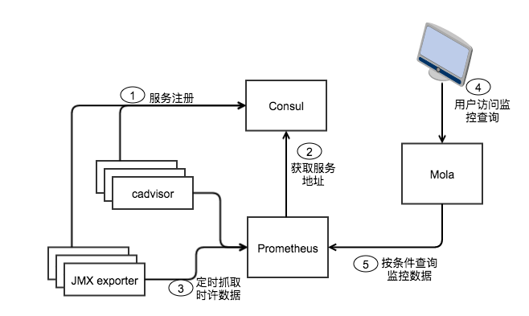
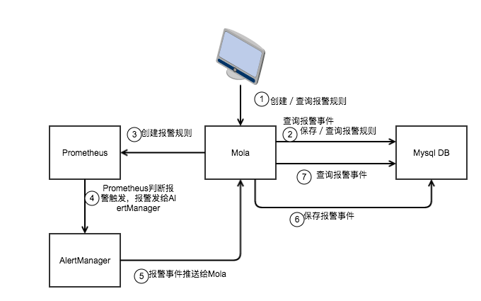
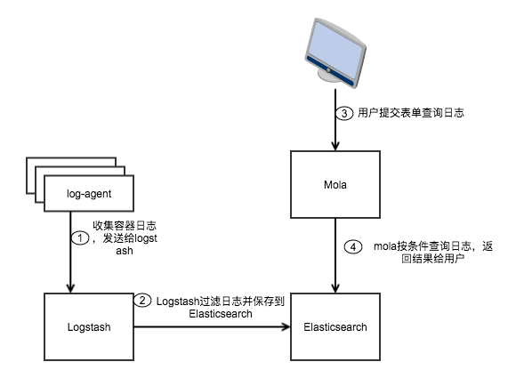
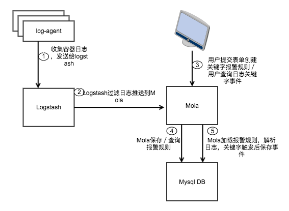

# Mola: Monitor, Log, Alert

Mola集成了容器性能数据展示，容器日志展示，报警消息的展示和静默操作。
* 容器性能数据: 通过查询[Prometheus](https://github.com/prometheus/prometheus)获得数据，提供API和UI查询的集群信息，主机信息，应用信息，容器信息，以及兼容[PromQL](https://prometheus.io/docs/querying/api/)的语法查询。
* [Log-agent](https://github.com/Dataman-Cloud/log-agent): 收集所在主机的容器日志，发给[Logstash](https://www.elastic.co/products/logstash)，存入[Elasticsearch](https://www.elastic.co/products/elasticsearch)。
* 容器日志展示: 通过查询Elasticsearch, 提供API和UI查询容器日志，关键字查询。
* 报警消息: 在Prometheus配置[报警规则](https://prometheus.io/docs/alerting/configuration/), 从[AlertManager](https://prometheus.io/docs/alerting/alertmanager/)获取报警消息和配置静默设置。

## 制作Docker镜像

* [build docker image](dockerfiles/README.md)

## 安装

* [Install Guide](docs/install/INSTALL.md)

## 用户手册

* [Manual Guide](docs/MANUAL.md)

## API文档

* [API Document](docs/API.md)

## 功能介绍及逻辑图

### 监控查询

1. 主机上运行的cadvisor和容器中运行的JMX exporter向Consul注册自己的地址。
2. Prometheus从Consul获取服务地址。
3. Prometheus定时从cadvisor和JMX exporter获取监控数据。
4. 用户访问Mola的监控查询页面，提交查询表单。
5. Mola从Prometheus按条件查询监控数据，返回结果给用户。

### 监控报警

1. 用户访问Mola监控报警页面，创建／查询报警规则，查询报警事件。
2. Mola在数据库里保存报警规则。
3. Moal在Prometheus上创建报警规则。
4. Prometheus判断收到的监控数据是否触发报警规则，如果是，发送报警到AlertManager。
5. AlertManagert推送报警事件到Mola。
6. Mola解析报警事件，保存到数据库。
7. Mola响应用户查询，从数据库查询报警事件。

### 日志查询

1. 主机上运行的log-agent收集容器的日志，发送给logstash。
2. Logstash过滤解析日志发送给Elasticsearch。
3. 用户提交表单查询日志。
4. Mola按条件查询日志，返回结果给用户。

### 日志报警

1. 主机上运行的log-agent收集容器的日志，发送给logstash。
2. Logstash过滤解析日志推送给mola。
3. 用户提交表单创建／查询报警规则。用户查询日志关键字事件。
4. Mola保存／查询报警规则到数据库。
5. Mola加载报警规则，从收到的日志中过滤出触发关键字的日志，保存事件到数据库，并响应用户查询。
