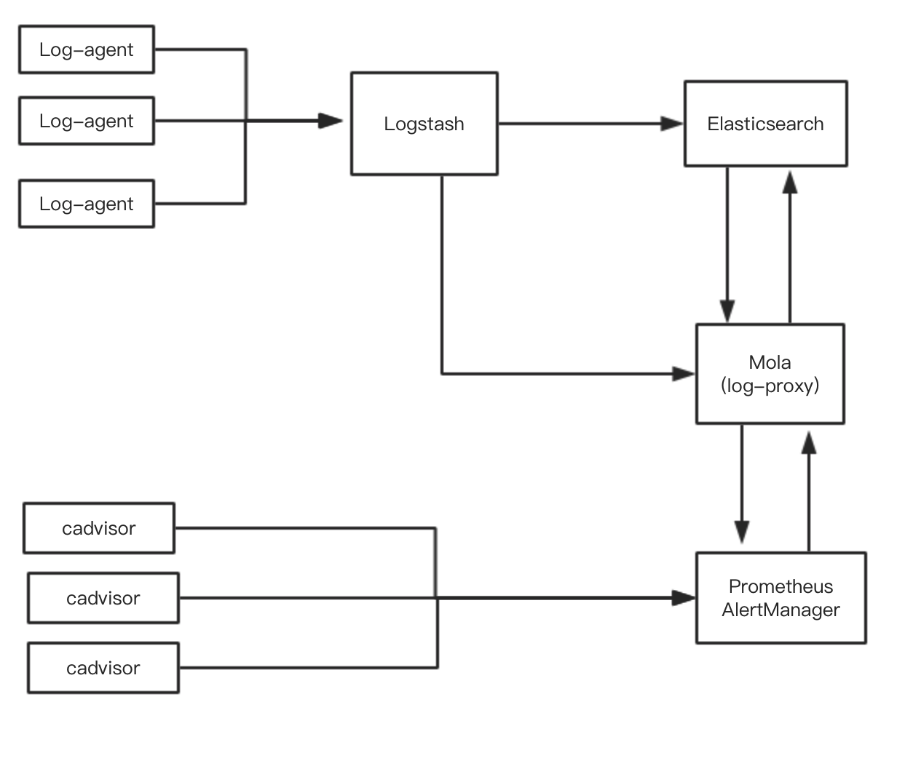

# Mola: Monitor, Log, Alert

Mola集成了容器性能数据展示，容器日志展示，报警消息的展示和静默操作。
* 容器性能数据: 通过查询[Prometheus](https://github.com/prometheus/prometheus)获得数据，提供API和UI查询的集群信息，主机信息，应用信息，容器信息，以及兼容[PromQL](https://prometheus.io/docs/querying/api/)的语法查询。
* [Log-agent](https://github.com/Dataman-Cloud/log-agent): 收集所在主机的容器日志，发给[Logstash](https://www.elastic.co/products/logstash)，存入[Elasticsearch](https://www.elastic.co/products/elasticsearch)。
* 容器日志展示: 通过查询Elasticsearch, 提供API和UI查询容器日志，关键字查询。
* 报警消息: 在Prometheus配置[报警规则](https://prometheus.io/docs/alerting/configuration/), 从[AlertManager](https://prometheus.io/docs/alerting/alertmanager/)获取报警消息和配置静默设置。

## 制作Docker镜像

* [build docker image](dockerfiles/README.md)

## 安装

* [Install Guide](docs/install/INSTALL.md)

## 用户手册

* [Manual Guide](docs/MANUAL.md)

## API文档

* [API Document](docs/API.md)

## 架构图

