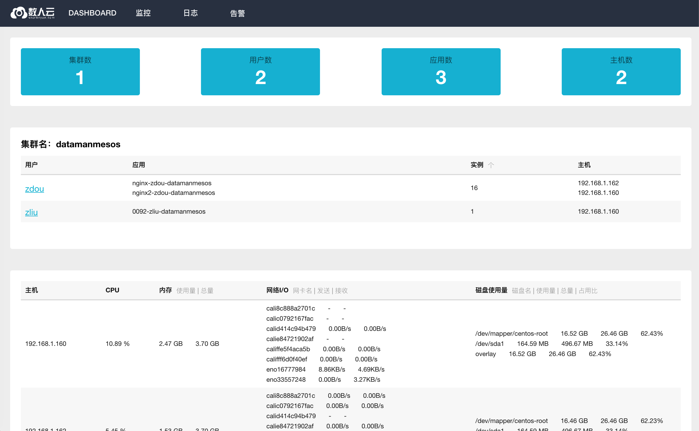
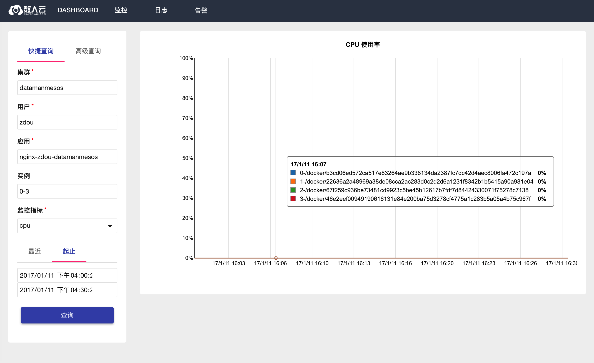

##日志监控报警 mola for swan


###访问界面

通过访问部署服务的主机的`5098`端口


###功能

####Dashboard

 统计集群信息：包括集群数、用户数、应用数、主机数

 集群列表：一个集群一个列表，显示运行在这个集群中的应用的统计信息。

 


 统计主机信息: 显示主机的实时性能指标

 

 点击集群列表里的用户名称，可以进入某个用户在这个集群中发布的应用列表页。

 - CPU ：取多实例实时占用分配的cpu资源的均值

 - 内存 ：取多实例实时占用分配的CPU资源的均值

 - 网络IO ：取多实例的IO实时的汇总值

 - 磁盘IO  ：取多实例的IO实时的汇总值

 


####监控

- 快捷查询

  输入集群名称，用户名称，应用名称，查询一段时间内某项指标的折线图，实例名可以输入范围查询，如“1-5”或者，”1,2,3,5,8“，置空时默认查全部。

  


   监控指标包括：

   - cpu : cpu 使用率

   - memory ：内存使用率

   - memory_usage ：内存使用量

   - memory_total： 内存总用量

   - network_rx ： 网络接收率

   - network_tx ：网络发送速率

   - fs_read ： 磁盘读取速率

   - fs_write ：磁盘写入速率


- 高级查询

基于表达式的查询方式，语法基于[prometheus](https://prometheus.io/docs/querying/api/)

示例

```
irate(container_cpu_usage_seconds_total{id=~"/docker/.*", name=~"mesos.*",container_label_APP_ID="work-nginx"}[5m])

```

说明：

 每五分钟取一次的应用`work-nginx`的cpu使用率。


####日志

支持`文件日志收集`、`stderr`、`stdout`的关键字过滤。


应用名、实例ID、日志来源为必填项，支持下拉选择。
实例支持0、0,1、0-2等多种方式查询
来源api支持stdout,stderr,...方式查询


####告警
#####告警规则

通过创建`日志过滤关键字` 来设置告警规则，同一个应用可以设置多条规则，每条的关键字暂只能定义一个。创建好的规则默认为生效。


可以通过`删除`或者`静默`使之停止，已经创建的规则，可以通过`更新`来改变关键字过滤。


#####告警历史

触发告警规则的日志，可以在此处查看,也可以对相应的规则做`静默`操作


#####静默管理

创建静默规则，设定某一段时间内的告警规则不生效。快捷方式是通过`告警历史`里查找相应规则操作。


  - 起始时间：静默开始时间
  - 结束时间：静默结束时间
  - 创建者：创建者邮箱
  - 注释：静默原因
  - 匹配项目：根据告警规则取得的匹配项目，根据告警规则匹配的项目而定。


已经建立的静默规则，可以`删除`或`编辑`。


 
